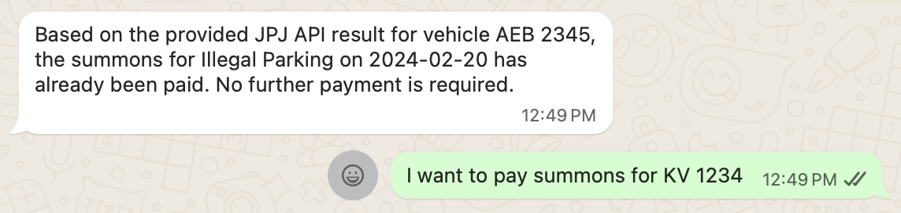
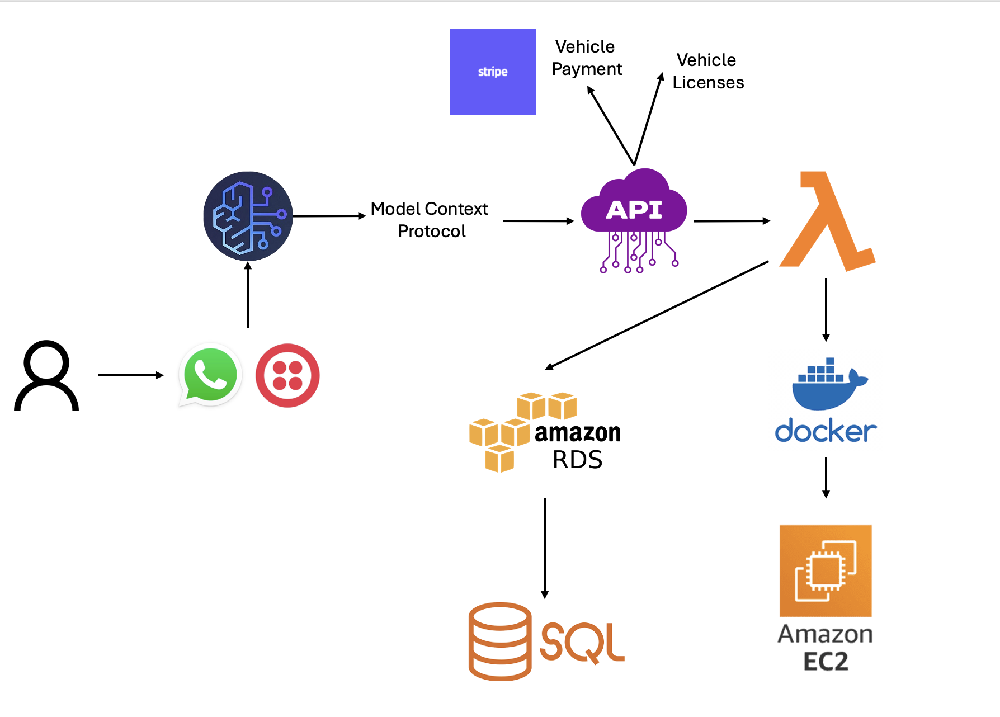

# Government Chatbot: AI-Enhanced Services with Model Context Protocol

(docs/images/demo2.png)(docs/images/demo3.png)(docs/images/demo4.png)  
*A WhatsApp-based AI chatbot for government services (license renewal, summons payment, and more).*

---

## 📌 Project Overview
This project is an **AI-powered government chatbot** that leverages the **Model Context Protocol (MCP)** to unify access to multiple government bodies.  
Citizens can interact with services such as **renewing licenses** and **paying summons** through **WhatsApp-like messaging tools**.  

The system integrates **AWS cloud services** for scalability and **Twilio WhatsApp API** for communication.

---

## ⚡ Features
- 💬 **WhatsApp-based chatbot** powered by **Twilio WhatsApp API**  
- 🧠 **AI-enhanced natural language understanding** with **AWS Bedrock**  
- 🔗 **MCP (Model Context Protocol)** backend for multi-agency integration  
- ☁️ **Serverless APIs** using **AWS Lambda**  
- 🗄️ **Persistent storage** with **AWS RDS (MySQL)**  
- 📦 **Containerized services** managed via **AWS ECR**  
- 🔍 **Logging, monitoring, and error handling** for reliable operation  

---

## 🛠️ Tech Stack
- **Programming Languages**: Python
- **Cloud & DevOps**: AWS (Lambda, Bedrock, RDS, ECR, S3), Docker, GitHub, Bash  
- **Messaging**: Twilio WhatsApp API  

---

## 🚀 Architecture
  
*High-level architecture showing how AWS services, MCP, and Twilio integrate together.*
